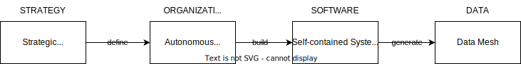

# Data Mesh Architecture

**Data Mesh Architecture** is a decentralised architecture that enables domain teams to perform cross-domain data analysis on their own.

- [ ] TODO: Picture of the Data Mesh Concept.

## Why Data Mesh?

Data Mesh enables data-driven decisions within our domain.

Central data teams failed to scale giving meaningful insights from data due to limited domain knowledge. 
Also, insufficient data quality led to disappointing results.

Many organizations already made a transformation towards domain-oriented teams and systems.
As a result, domain teams have a deep understanding of their processes and data.

A Data Mesh Architecture, as a decentralized approach for analytical data, now gives domain teams capabilities to analyze data on their own and to provide it to other domains.

On this website we aim to give an understanding of integral parts involved in a Data Mesh Architecture and to show how to introduce it in your organization.

