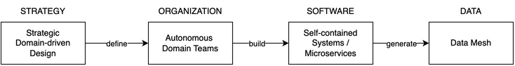

# Data Mesh Architecture

**Data Mesh Architecture** is a decentralised architecture that enables domain teams to perform cross-domain data analysis on their own.

## Why Data Mesh?

Data Mesh enables data-driven decisions within our domain.

Central data teams failed to scale, giving meaningful insights from data due to limited domain knowledge. 

Many organizations have already made a transformation towards domain-oriented teams and systems. As a result, domain teams have a deep understanding of their processes and data.

Being a decentralized approach for analytical data, a Data Mesh Architecture now gives domain teams capabilities to analyze data on their own and provide it to other domains.

On this website, we describe integral parts of a Data Mesh Architecture and show how to introduce it in your organization.

## What is Data Mesh?

TBD

