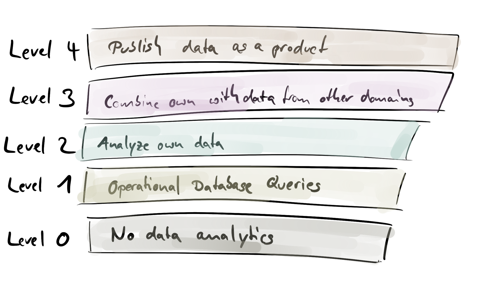

# Data Mesh Architecture: Data Mesh from an Engineering Perspective

Today, data analysis is central to the success of companies, but it's hard to scale.
Data Mesh addresses the issue of scaling of a central data team in a world of decentralised domain teams.
The goal of this website is to *focus on the engineering perspective of the domain teams* and to give advice and examples how to organize, build, and operate a Data Mesh within your organization.

> **Data Mesh Architecture** is a decentralised architecture that enables domain teams to perform cross-domain data analysis on their own.

- [ ] TODO: Picture of the Data Mesh Concept.

The term *Data Mesh* was coined by [Zhamak Dehghani](https://martinfowler.com/articles/data-monolith-to-mesh.html).

## Why

- status quo 1: Value proposition perspective
 - innovative product development: improve existing products or create new products

## Data Mesh Principles
Data Mesh builds upon four principles: 

1. __Domain Ownership__ TODO...
1. __Data as a Product__ TODO...
1. __Self-Serve Data Platform__ TODO...
1. __Computational Federated Governance__ TODO... 

## Case Study

## Data Mesh Maturity Model

TODO: schönere Grafik

This maturity model describes the evolution of a domain team in a data mesh architecture.

Level 0: No data analysis.

Level 1: Operational database queries.
- Variant: query on secondary nodes

Level 2: Analyze own data on self-serve data platform.
- Includes ingesting, storage, analysis, visualization.
- Variant: custom analytical postgres DB

Level 3: Combine own with data from other domains.
- Includes discoverability and access
- Use a data catalog

Level 4: Publish data as a product.
- Build and maintain data product
- Operational monitoring
- Describe data product in catalog

## Architecture Components

- Data Ingesting
- Data Storage
- Information Architecture: Raw, ...
- Pipelines
- Clean Data
- Data Access
- Data Catalog
- Analysis
- Visualisation
- Results: Dataset, ML Models, Report, KPI, Events
- Feedback Loops: Insights -> Business Value
- Security
- Monitoring

## Organisation

- Domain-aligned Teams
- Team Structure / Team Topology
- More scope, Skillset
- Role of Data Team
  - Manage Platform
  - Enabling (Templates, ...)
  - Consulting
  - Form new domain teams
- Governance
  - Guilds
  - Define Global Policies
- Requirements -> Data Product

## Backup

Data Ingesting
- Operative Systems to Analytical Platform
- Patterns: ETL vs Streaming
- External Data
- Examples:
  - Cloud Functions
  - Spring Boot Service 
  - Dataflow / Apache Beam

Data Storage
- Cloud
- Streaming?
- Examples:
  - BigQuery

Data API/Endpoints/Ports
- Types: Dataset, Dashboard, Report
- Feedback back to operative Systems

Data Catalog
- Meta data
- Best Practices
- Examples: 
  - Confluence
  - Git Repo
  - Google Data Catalog

Security
- PII

## FAQ

- Ab welcher Organisationsgröße lohnt sich Data Mesh?

# Resources

# Authors
Jochen Christ
Simon Harrer
Larysa Visengeriyeva

